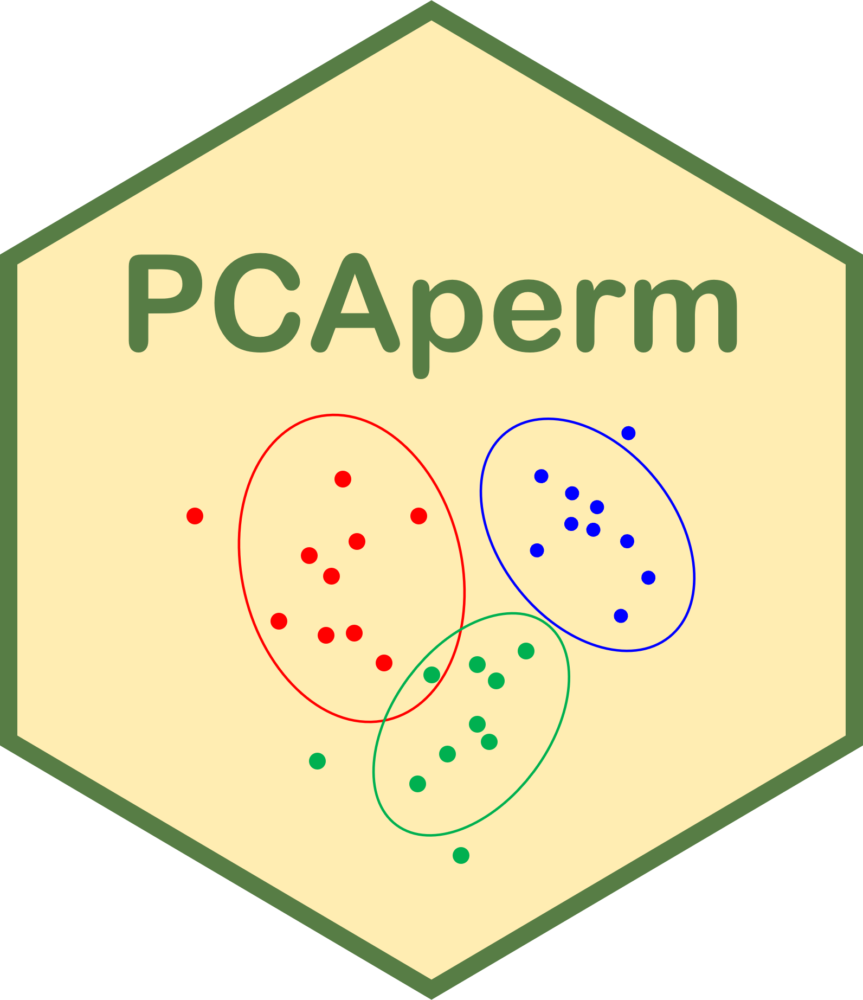

# PCAperm 

<!-- badges: start -->
[](https://github.com/Carol-seven/PCAperm/actions/workflows/R-CMD-check.yaml)
<!-- badges: end -->

The goal of **PCAperm** is to implement a permutation test for principal components
analysis (PCA).

## Installation

You can install the development version of **PCAperm** from [GitHub](https://github.com/)
with:

``` r
# install.packages("devtools")
devtools::install_github("Carol-seven/PCAperm")
```
